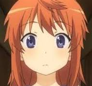

# Natsumi

I made this to help myself rewatch non non biyori for the 100th time. It randomly picks an episode for me to watch and keeps track of the ones I've seen, and ensures I get a unique experience in every rewatch.

The design is heavily inspired by the handmade aesthetic of the anime, aiming to feel like something the characters themselves might have made in the countryside village of Asahigaoka.

## Features

  * **Random Episode Selection**: Click the "Pick a Random Episode\!" button to get a random suggestion from the episodes you haven't watched yet.
  * **Watched List Tracking**: Mark episodes as "watched" to move them from the "Unwatched" list to the "Watched" list.
  * **Local Storage Memory**: Your list of watched episodes is saved in your browser's local storage, so it will remember your progress even after you close the page.
  * **Complete Episode Catalog**: Includes all episodes from *Non Non Biyori* (Season 1), *Non Non Biyori Repeat* (Season 2), *Non Non Biyori Nonstop* (Season 3), and the movie, *Vacation*.
  * **Reset Functionality**: Finished the entire series? You can easily reset the list to start your relaxing journey all over again.
  * **Themed, Rustic UI**: A user interface carefully designed with a "handmade" feel, featuring a scrapbook-style layout, wooden buttons, character art, and a color palette inspired by the anime's beautiful scenery.

## How to Use

No complicated setup required\!

1.  Save the provided code as an `index.html` file.
2.  Open the `index.html` file in any modern web browser (like Chrome, Firefox, or Edge).
3.  Click the **"Pick a Random Episode\!"** button to get your first suggestion.
4.  After watching, click **"Finished Watching\!"** to add it to your watched list.
5.  Your lists will automatically update. Enjoy the show\!

## Tech Stack

This project is a self-contained single-file web application built with:

  * **HTML5**: The core structure of the page.
  * **CSS3 & Tailwind CSS**: For styling and layout. Custom CSS is used to create the unique, rustic theme.
  * **JavaScript (ES6)**: Powers the application's logic.
  * **React (v18)**: Used for building the interactive user interface.
  * **Babel**: To transpile the JSX (React's syntax) into plain JavaScript that browsers can understand, right inside the browser.
  * **Google Fonts**: For the charming, handwritten "Yomogi" font.

## Aesthetic & Design Philosophy

The primary goal of the design was to move away from a generic web app look and create something that feels authentic to the world of *Non Non Biyori*.

  * **Color Palette**: Soft, natural colors (creams, muted greens, warm browns) were chosen to reflect the anime's countryside setting.
  * **Textures**: The main panel uses a "craft paper" background, and buttons are styled to look like "wooden planks" to give a tactile, handmade feel.
  * **Typography**: The "Yomogi" font was selected for its friendly, handwritten appearance.
  * **Decorative Elements**: Small illustrations of the characters are placed around the edges, and the selected episode card has a "taped-on" look, contributing to a charming scrapbook or diary aesthetic.